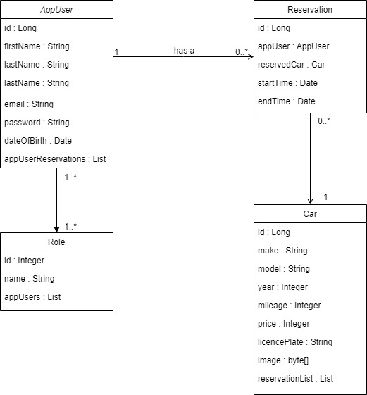

# Car Rental Web Application

## Table of Contents
- [Introduction](#introduction)
- [Features](#features)
- [Technologies Used](#technologies-used)
- [Installation](#installation)
- [Usage](#usage)
- [Schema Visualisation](#schema-visualisation)

## Introduction
The Car Rental Web Application is a platform that allows users to browse, search, filter, and sort a wide variety of vehicles available for reservation. This application is built using modern web development technologies to provide a seamless user experience.

## Features
- User account creation and authentication
- Browse a list of available vehicles.
- Search for vehicles by make, model, or year.
- Filter vehicles based on mileage, year, and price.
- Sort vehicles by mileage, year, or price in ascending or descending order.
- Reserve a vehicle (authentication required).
- Manage cars and reservations (admin only).

## Technologies Used
- **Frontend:**
  - React
  - React Bootstrap
  - React Paginate
- **Backend:**
  - Spring Boot
  - Spring Security
  - Spring Data JPA
- **Database:**
  - PostgreSQL
- **Authentication:**
  - JWT (JSON Web Tokens)

## Installation
### Prerequisites
- Node.js and npm installed
- Java JDK 11+
- Gradle

### Frontend Setup
1. Navigate to the frontend directory:
    ```bash
    cd frontend
    ```
2. Install the dependencies:
    ```bash
    npm install
    ```
3. Start the development server:
    ```bash
    npm start
    ```

### Backend Setup
1. Build the project using Gradle:
    ```bash
    ./gradlew build
    ```
2. Run the Spring Boot application:
    ```bash
    ./gradlew bootRun
    ```

## Usage
1. Open your browser and go to `http://localhost:3000` for the frontend.
2. Use the search bar to find vehicles by make, model, or year.
3. Apply filters to narrow down your search results.
4. Use the sorting dropdown to arrange the vehicle list by mileage, year, or price.
5. Click the "Reserve" button to reserve a vehicle (requires authentication).

## Schema Visualisation
